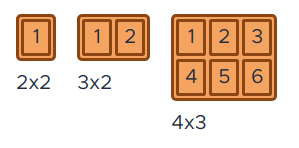

## 6322 - Mi tienda de gofres

__Importante__: 

  - Recuerda tomar nota del tiempo total en minutos (o en horas y minutos) que dedicas a realizar la actividad.
  - El código debe estar comentado de forma que javadoc sea capaz de generar la documentación de la aplicación.
  - Crea tu repositorio remoto en GitHub siguiendo este link: https://classroom.github.com/a/EfNSY_z-
  
### Enunciado

Mi tienda de gofres, "Gofres for everyone", es famosa por ser la tienda con los gofres más ricos de León. Siempre hemos presumido de tener los gofres con forma más rectangular de toda la región. De hecho, ¡queremos tener un sistema informático que nos cuente hasta los huecos que tiene cada gofre!

La idea es que le digamos al sistema el número de líneas verticales y horizontales de cada gofre y el nos devuelva los huecos existentes. 

Se pide que implementes el programa para que pase la siguiente clase de tests:

* [Clase de test](Test6322.java)

Por ejemplo, si el valor del parámetro es `"3\n2 2\n3 2\n4 3\n"` (en el que el primer número indica siempre los casos de prueba que se incluyen), el valor devuelto debe ser `"Caso #1: 1\nCaso #2: 2\nCaso #3: 6\n"`.

Se adjunta una imagen de este ejemplo para entender mejor el enunciado:

### Entrega

Cuando hayas terminado la actividad haz un push de la rama master al repositorio remoto de Github.

Haz un comentario público indicando:

  - El tiempo en horas y minutos que has tardado en completar la actividad.
  - El grado de dificultad que has apreciado.
  - Aquello que más te ha costado de la actividad.
  - El hash de 7 caracteres del último commit.
  
Entrega:

  - La URL de la pantalla del listado de commits de Github.
  - Una captura de pantalla de la pantalla anterior donde se muestren los commits realizados.
  - La URL de un video de Youtube donde se muestre cómo la aplicación pasa todos los tests.
  - Un comentario privado con el mismo contenido que el comentario público anterior.
  - Otro comentario privado (¡obligatorio!) donde indiques en lenguaje natural (¡en castellano!) cómo funciona tu método (recuerda que no quiero que me digas línea a linea que hace sino cual es la idea general de funcionamiento del método).
