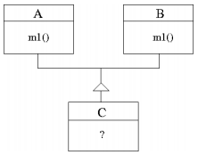

Al contrario que en otros lenguajes, en Java no existe la herencia múltiple. En la siguiente figura se presenta un diseño (no permitido en Java) en el que la clase C hereda tanto de A como de B. Si, como ocurre en el ejemplo, las dos superclases A y B contienen el método `m1()` y dicho método está implementado de forma distinta en cada una de ellas, existiría un conflicto respecto a cuál de las dos implementaciones de `m1()` debería heredar C. 

Este conflicto, por otro lado, no se daría si `m1()` se hubiese definido abstracto tanto en A como en B, ya que en este caso el método no estaría implementado y por tanto no cabría esperar conflicto alguno. Podría pensarse, por tanto, que si A y B fuesen clases abstractas no debería haber inconveniente en permitir la herencia múltiple. Sin embargo, las clases abstractas pueden contener métodos no abstractos, con lo que la exigencia propuesta de que las superclases sean abstractas no garantizaría la ausencia de conflictos en un esquema de herencia múltiple.
